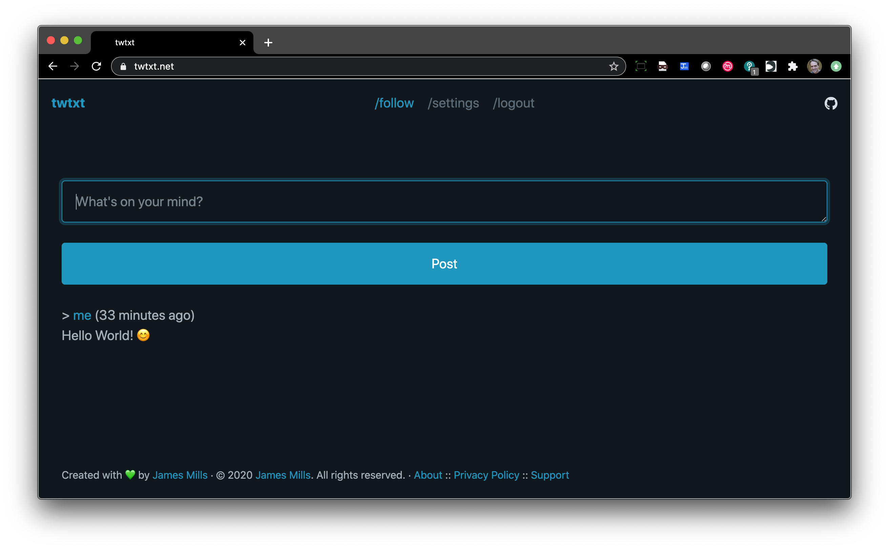

# twtxt

[](https://cloud.drone.io/prologic/twtxt)
[](https://codecov.io/gh/prologic/twtxt)
[](https://goreportcard.com/report/prologic/twtxt)
[](https://godoc.org/github.com/prologic/twtxt) 
[](https://sourcegraph.com/github.com/prologic/twtxt?badge)

twtxt is a [twtxt](https://twtxt.readthedocs.io/en/latest/) client in the form
of a web application and command-line client. It supports multiple users and
also hosts user feeds directly. It also  has a builtin registry and search.

There is also a publically (_free_) service online available at:

- https://twtxt.net/




## Installation

### Source

```#!bash
$ go get -u github.com/prologic/twtxt/...
```

## Usage

### CLI

Run twt:

```#!bash
$ twt
```

### Web App

Run twtd:

```#!bash
$ twtd
```

Then visit: http://localhost:8000/

## License

twtwt is licensed under the terms of the [MIT License](/LICENSE)
